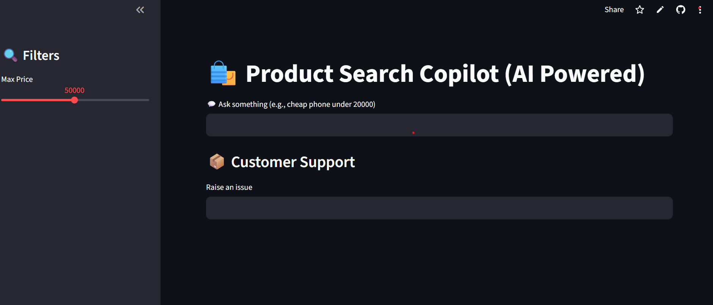
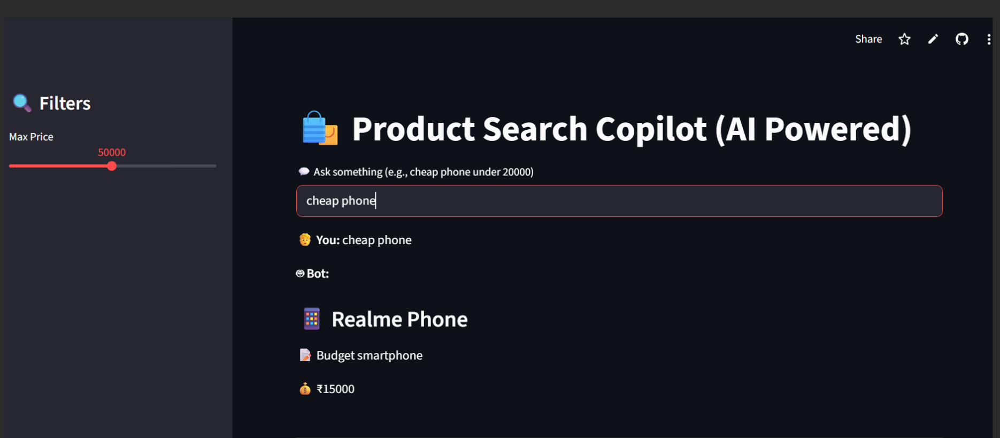
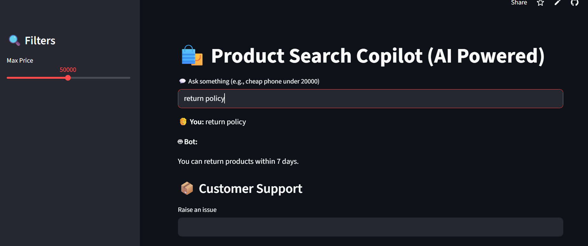

# 🛍️ Product Search Copilot

## 📌 Description
AI-powered product search system using LangChain, FAISS, and Streamlit.

## 🚀 Features
- Product search using AI
- Price filtering (cheap / under price)
- Category filtering
- FAQ support
- Ticket creation system
- Admin analytics (search count)

## 🧰 Tech Stack
- Python
- Streamlit
- LangChain
- FAISS
- Sentence Transformers
- Pandas

## ▶️ How to Run
pip install -r requirements.txt
streamlit run app.py

## 🧪 Test Cases
Input: cheap phone  
Output: Realme Phone  

Input: tv under 50000  
Output: Samsung TV  

Input: return policy  
Output: You can return products within 7 days.

## 📸 Screenshots
(Add screenshots here)

## 🌐 Live App
(Add your Streamlit link here)
## 📸 Screenshots

### Home Screen

### Search Result

### FAQ

### Ticket System

